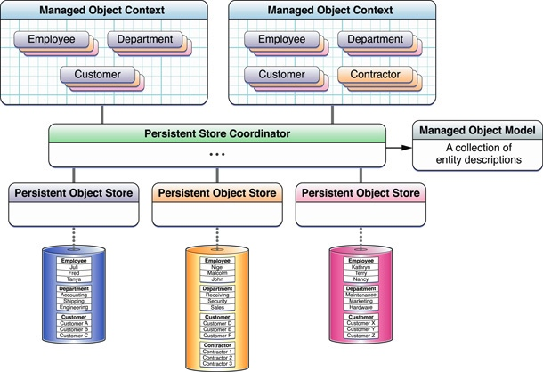

# Core Data
###1.什么是Core Data
在我的理解中，Core Data是苹果提供的一套模型缓存框架。该框架是对数据库的进一步封装，让使用者不用编辑复杂的sql语句，以及能使用图形界面来便捷的创建存储模型。(如果理解有误，敬请斧正 谢谢)

具体的描述可以参考[objcn.io](http://objccn.io/issue-4-1/)以及Core Data[官方介绍](https://developer.apple.com/library/prerelease/content/documentation/Cocoa/Conceptual/CoreData/);
###2.Core Data基本概念
Core Data中有几个基本的概念需要注意：(~~术语感觉没有统一的翻译，按照自己感觉来，如有错误，那就请不要在乎这点细节~~)


（图片源自apple官方）

* **ManagedObjectContext(管理对象上下文)**

管理对象上下文（Context），是Core Data在中用来管理 管理对象(ManageObject)与连接 持久化存储助理 (PersistentStoreCoordinator)。Context可以直接连接到Coordinator上也可以连接到另一个Context上由另一个Context再连接到Coordinator上。
Context为管理对象提供了一个展现空间，对象在Context中做的改变，如果你不主动save，是不会保存到存储中去的。所以它很便捷的提供了 撤销重做的功能。用户的所有增删改查操作也全部是通过context来完成的。

* **PersistentStoreCoordinator**

持久化存储助理(Coordinator ~~到底是翻译成协调器还是助理，我表示也很懵逼~~)是用来连接context、管理 管理对象模型(ManagedObjectModel)、连接存储对象(PersistentObjectStore)。

Coordinator把所有Store集中起来管理，提供给context一个统一的入口。所有的Context查询操作通过Coordinator来在所有store中查找。

* **ManagedObjectModel**

管理对象模型(ManagedObjectModel)，我的理解就是在Core Data中相当于数据库中的表，用来描述管理对象(ManagedObject)的结构与属性。

* **ManagedObject**

管理对象(ManagedObject)，就是通过管理对象模型定义的一个实体。也相当于数据库中表的一条记录。通过Context来创建与修改管理。

* **PersistentObjectStore**

持久化存储(PersistentObjectStore),用来存储数据的.......


以上都是作者个人理解，可能会有偏差的地方。更多信息请参阅[官方文档](https://developer.apple.com/library/prerelease/content/documentation/DataManagement/Devpedia-CoreData/coreDataOverview.html)。

###3.Core Data基本使用

要使用Core Data来存储数据，首先得初始化Core Data所需要的对象，以及建立对象之间的联系。

首先，创建NSManagedObjectContext对象，也就是context

```objective-c
- (NSManagedObjectContext *)managedObjectContext{
    if (_managedObjectContext == nil) {
        _managedObjectContext = [[NSManagedObjectContext alloc]initWithConcurrencyType:NSMainQueueConcurrencyType];
        _managedObjectContext.persistentStoreCoordinator = self.persistentStoreCoordinator;
    }
    return _managedObjectContext;
}
```
context的初始化方法 **initWithConcurrencyType** 中需要你选定context的类型，该枚举有三种类型：[详细区别](http://stackoverflow.com/questions/11176275/when-to-use-core-datas-nsmainqueueconcurrencytype)

```objective-c
typedef NS_ENUM(NSUInteger, NSManagedObjectContextConcurrencyType) {
    NSConfinementConcurrencyType  = 0x00,
    NSPrivateQueueConcurrencyType = 0x01,
    NSMainQueueConcurrencyType    = 0x02
} NS_ENUM_AVAILABLE(10_7,  5_0);
```
创建完context之后，还得将context与Coordinator联系起来。

```objective-c
- (NSPersistentStoreCoordinator *)persistentStoreCoordinator{
    if (_persistentStoreCoordinator == nil) {
        
        NSURL *storeUrl = [[self applicationDocumentDirectoryUrl]URLByAppendingPathComponent:@"iDo.sqlite"];
        NSError *error = nil;
        _persistentStoreCoordinator = [[NSPersistentStoreCoordinator alloc]initWithManagedObjectModel:self.managedObjectModel];
        [_persistentStoreCoordinator addPersistentStoreWithType:NSSQLiteStoreType configuration:nil URL:storeUrl options:nil error:&error];
     }
    return _persistentStoreCoordinator;
}

- (NSURL *)applicationDocumentDirectoryUrl{
   return [[NSFileManager defaultManager]URLsForDirectory:NSDocumentDirectory inDomains:NSUserDomainMask].lastObject;
}
```

Coordinator需要Model对象来进行初始化。并且通过**addPersistentStoreWithType:**方法与Store建立联系。

```objective-c
- (NSManagedObjectModel *)managedObjectModel{
    if (_managedObjectModel == nil) {
        NSURL *modelUrl = [[NSBundle mainBundle]URLForResource:@"iDo" withExtension:@".momd"];
        _managedObjectModel = [[NSManagedObjectModel alloc]initWithContentsOfURL:modelUrl];
    }
    return _managedObjectModel;
}
```
model对象初始化需要指定.momd文件，momd文件就是.xcdatamodeld编译产生的文件，所以文件不存在也不会报错。如果你项目中只有1个.xcdatamodeld文件，那么不指定也可以，Xcode会自动在项目中匹配到model。

**添加数据**

```objective-c
    //存储
    NSManagedObject *entity = [NSEntityDescription insertNewObjectForEntityForName:@"Entity" inManagedObjectContext:self.context];
    //管理对象的属性可以使用点语法来访问
    entity.property = @"xxx";
    //保存数据
    [self.context save:nil];
```

**查询数据**

```objective-c

    //创建一个查询对象
    NSFetchRequest *request = [NSFetchRequest fetchRequestWithEntityName:@"Entity"];

    //查询条件（如不填写默认返回全部）
    NSPredicate *pre = [NSPredicate predicateWithFormat:@"查询条件"];
    request.predicate = pre;
    
    //排序
    NSSortDescriptor *sort = [NSSortDescriptor sortDescriptorWithKey:@"用来排序的属性" ascending:NO];
    request.sortDescriptors =@[sort];
    
    //查询 （数组中包含所有符合条件的记录）
    NSArray *array = [self.context executeFetchRequest:request error:nil];
```

**删除数据**

```objective-c

    //创建一个查询对象
    NSFetchRequest *request = [NSFetchRequest fetchRequestWithEntityName:@"Entity"];

    //查询条件（如不填写默认返回全部）
    NSPredicate *pre = [NSPredicate predicateWithFormat:@"查询条件"];
    request.predicate = pre;
    
   //查询
    NSArray *array = [self.context executeFetchRequest:request error:nil];
    for (Entity *entit in array) {
        //删除
        [self.context deleteObject:entit];
        //保存
        [self.context save:nil];
    }

```

**修改数据**

```objective-c

    //创建一个查询对象
    NSFetchRequest *request = [NSFetchRequest fetchRequestWithEntityName:@"Entity"];

    //查询条件（如不填写默认返回全部）
    NSPredicate *pre = [NSPredicate predicateWithFormat:@"查询条件"];
    request.predicate = pre;
    
   //查询
    NSArray *array = [self.context executeFetchRequest:request error:nil];
    for (Entity *entit in array) {
        //修改
        entit.name = @"123";
        //保存
        [self.context save:nil];
    }

```


###4.Core Data版本迁移
项目中难免遇到需要修改实体结构，如果尚在开发中还好，直接删除重新安装。若已经上架则需要进行版本迁移，让旧版本的数据能够顺利转移到新版本中。

简单的版本迁移 Coordinator 可以直接推断出文件映射，但是复杂的版本迁移就需要自己手动添加文件映射。要让Coordinator支持自动推断，需要在创建Coordinator的时候添加一个字典，字典中包含以下内容。

```objective-c
			//版本迁移所用字典
        NSMutableDictionary  *dictionary = [NSMutableDictionary dictionary];
        [dictionary setObject:@(YES) forKey:NSInferMappingModelAutomaticallyOption];
        [dictionary setObject:@(YES) forKey:NSMigratePersistentStoresAutomaticallyOption];
        NSError *error = nil;
       [_persistentStoreCoordinator addPersistentStoreWithType:NSSQLiteStoreType configuration:nil URL:storeURL options:dictionary error:&error]
```

版本迁移首先需要选中.xcdatamodeld文件，Editor-> Add Model Version 创建新版本。


然后在右侧检测器中的Model Version中选中新版本。


然后修改实体表，并更新实体文件。

最后创建xcmappingmodel文件 先选择旧集合，再选择新集合然后确定。

至此版本更新完成。


