# 自动集成环境介绍
在实际开发环境中，出于种种原因，不得不构建一个自动化集成环境来提高效率。网上找了一下资料，发现虽然乍一看方法千千万，但大部分iOS自动集成环境核心都是基于 jenkins 来实现的。
翻看了相关的部分资料，最后选择用 jenkins + github + fir.im 来构建自己的自动化继承环境。
###jenkins
>Jenkins是一个用Java编写的开源的持续集成工具。在与Oracle发生争执后，项目从Hudson项目复刻。
Jenkins提供了软件开发的持续集成服务。它运行在Servlet容器中（例如Apache Tomcat）。它支持软件配置管理（SCM）工具（包括AccuRev SCM、CVS、Subversion、Git、Perforce、Clearcase和和RTC），可以执行基于Apache Ant和Apache Maven的项目，以及任意的Shell脚本和Windows批处理命令。Jenkins的主要开发者是川口耕介。[2]Jenkins是在MIT许可证下发布的自由软件。[3]
可以通过各种手段触发构建。例如提交给版本控制系统时被触发，也可以通过类似Cron的机制调度，也可以在其他的构建已经完成时，还可以通过一个特定的URL进行请求。
来源---[维基百科](https://zh.wikipedia.org/wiki/Jenkins_(软件))

###github
>GitHub是一个利用Git进行版本控制、专门用于存放软件代码与内容的共享虚拟主机服务。它由GitHub公司（曾称Logical Awesome）的开发者Chris Wanstrath、PJ Hyett和Tom Preston-Werner使用Ruby on Rails编写而成。
GitHub同时提供付费账户和免费账户。这两种账户都可以建立公开的代码仓库，但是付费账户也可以建立私有的代码仓库。根据在2009年的Git用户调查，GitHub是最流行的Git存取站点。[2]除了允许个人和组织建立和存取代码库以外，它也提供了一些方便社会化软件开发的功能，包括允许用户追蹤其他用户、组织、软件库的动态，对软件代码的改动和bug提出评论等。GitHub也提供了图表功能，用于显示开发者们怎样在代码库上工作以及软件的开发活跃程度。
截止到2015年，GitHub已经有超过九百万注册用户和2110万代码库。[3]事实上已经成为了世界上最大的代码存放网站和开源社区。[4]
来源---[维基百科](https://zh.wikipedia.org/wiki/GitHub)


###fir.im
>fir.im 为开发者提供测试应用极速发布，应用崩溃实时分析、用户反馈收集等一系列开发测试效率工具服务，帮助开发者将更多精力放在产品的开发与应用的优化上。
来源---[维基百科](https://fir.im)


#安装
###jenkins安装
在网上各种教程中，Mac上 jenkins 安装具体有两种:

1. 官网直接下载 ----[网址](jenkins.io)

2.	 homebrew、brew 安装

```
brew cask install jenkins
```
个人推荐用第一种方法直接从官网下载，通过图形界面安装。因为我在实际安装过程中发现通过homebrew安装的jenkins版本稍低于常用版本，导致后面某些插件无法使用。

jenkins安装完成之后，可以通过[浏览器](http://localhost:8080)访问了。  

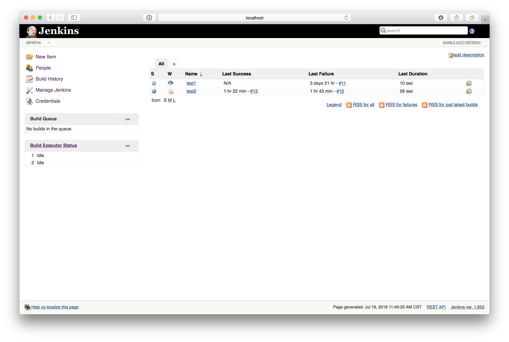

(~~~使用的为英文系统，所以界面也默认是英文。应该产生不了阅读障碍吧。。。。。。~~~)

###插件安装
插件安装方法： Manage Jenkins -> Manage Plugins

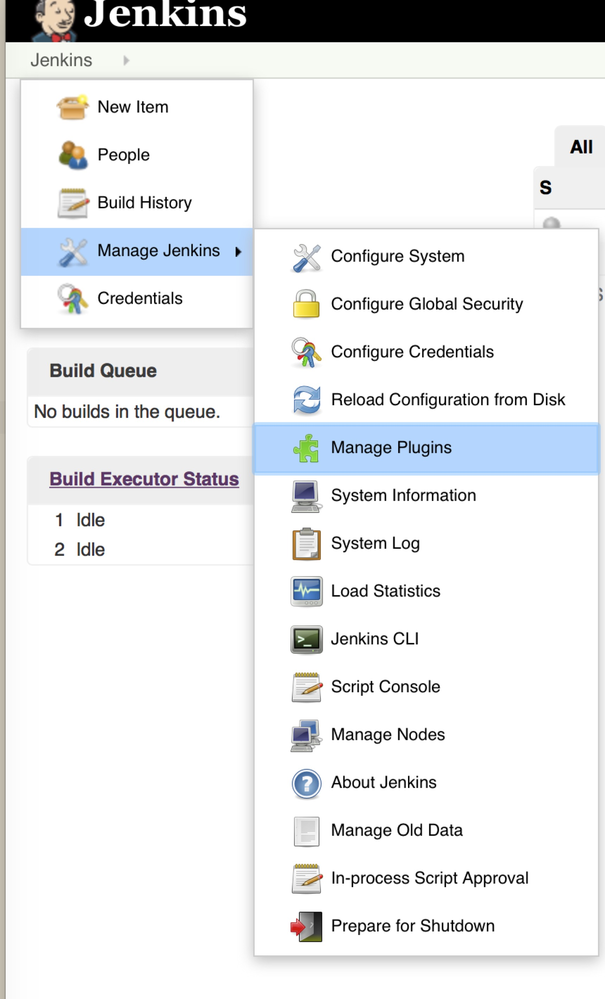


所需插件如下：

>git plugin
>
>github plugin
>
>Xcode integration
>
>Post-Build Script Plug-in
>

###jenkins配置

jenkins以及插件都已经安装完成了，那就可以开始愉快的配置jenkins了。jenkins配置其实主要配的就几个点,jenkins从什么地方拉取代码，这个大部分是用git管理了，所以基本填的也应该是git服务器地址咯。然后就是代码拉取下来之后的打包，打完包之后上传指定托管网站。网上的配置方法的不同，大致就是打包使用的方法不同。

因为我准备使用的是上传到fir.im。且fir.im有个插件支持一键打包上传，所以只要在jenkins配置一行命令就能实现打包并上传的流程。so 我选择的是这种方法。

#####新建项目

选择New Item -> 填写项目名 -> 选择 Freestyle project -> OK

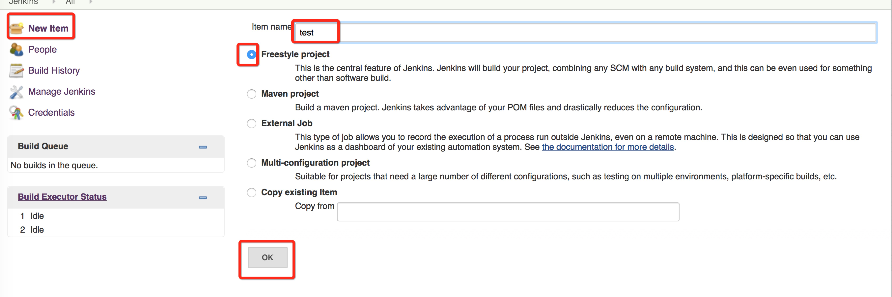

创建完项目之后，填写项目名称，描述等等，可以选择性的勾选 GitHub project 填写自己的github仓库地址。这样创建完之后，在侧边会有一个按钮可以直接转跳到github上。

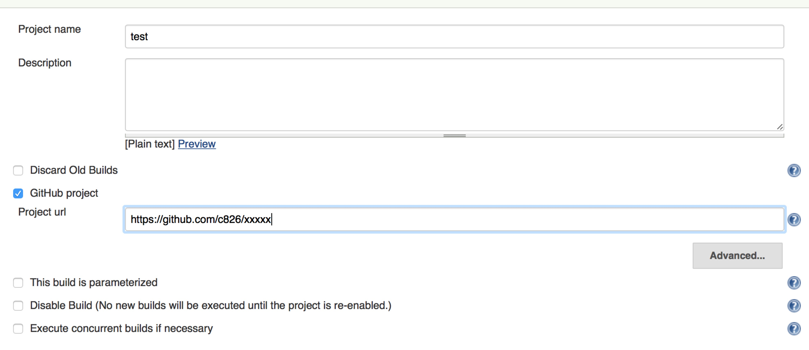

可以转跳到指定仓库的按钮

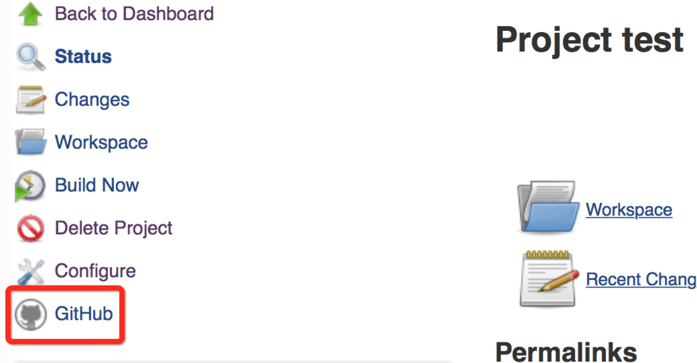


#####指定源码地址
填完一些基本信息之后，就需要配置源码地址了。因为我是放在github上面托管，所以选择git。然后填上你的仓库地址。如果是公开仓库，其他都选默认就OK了，配置完成。

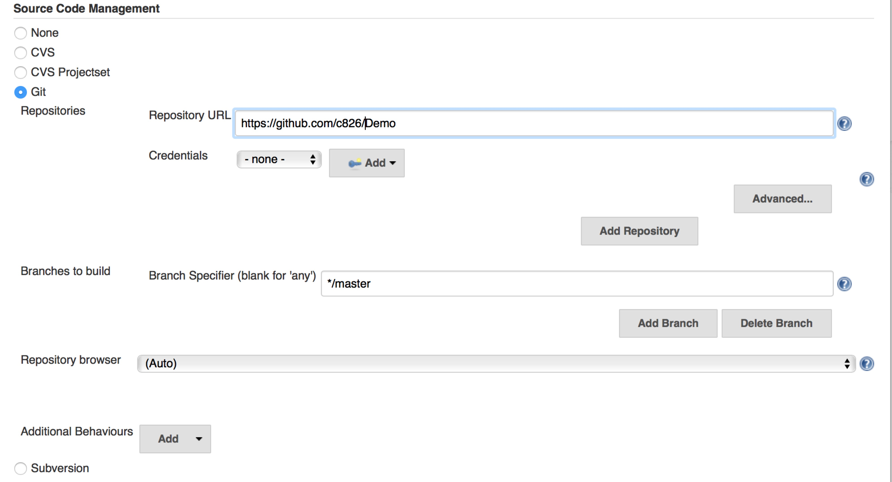

如果是私有仓库，则需要配置证书才能通过验证来拉取代码。点击Add添加。
默认选择用户密码验证
Username: 用户名
Password: 密码
ID Description: 填不填无所谓

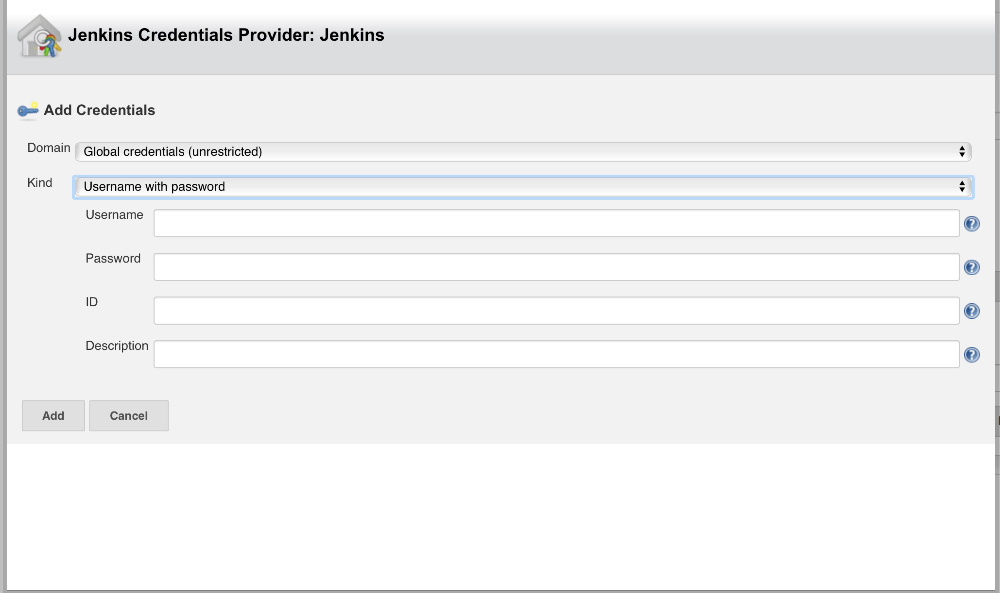


#####触发构建
说来惭愧，本来是想配置成 github 每次 commit Jenkins就自动打包上传一次，配置起来出了点小问题，研究一下没弄明白，后面就弃坑了。等什么时候有空了再重新来弄一下。
所以就配置了每天早上8点跟晚上7点自动打包上传。这条配置怎么写，点击边上的问号，会有详细的解释。
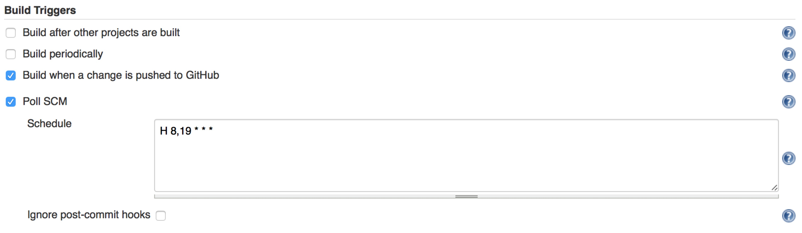

######打包上传
打包上传需要用到fir.im的一个插件[fir-cli](https://github.com/FIRHQ/fir-cli/blob/master/README.md).

安装：

```
gem install fir-cli
```

安装完成后继续配置，选择 Execute shell。

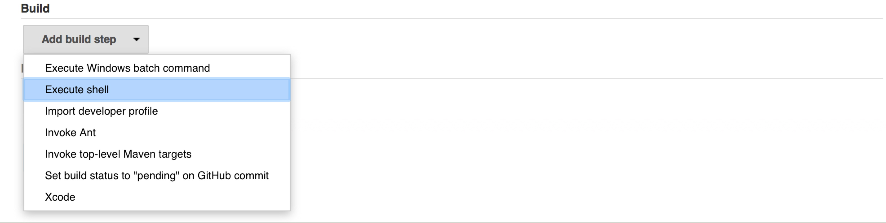

填入如下命令 -> 保存 -> 立即构建

```
fir build_ipa ${WORKSPACE}  -p -T #API Token#
```

${WORKSPACE} 是指定jenkins中默认的项目地址。
API Token 是fir.im给定的，可以自己去fir.im上生成。

如果你的项目没有使用Cocoapods来管理第三方库的话，到上面这一步，就已经完成了。如果使用了，那么恭喜你，还得结往下看。

```
fir build_ipa ${WORKSPACE}/ -w  -S # Schemes # -p -T #API Token#
```
增多了两个参数 -w -S ，w表示workspace 默认可以不填，-S 代表 Schemes 。因为使用了cocoapods管理的项目，需要指定 Schemes才能准确通过编译。

更多的命令解释清参考[fir-cli](https://github.com/FIRHQ/fir-cli/blob/master/README.md)。


#####测试

配置完成，点击立即构建。构建历史可以看到历史的每一次构建。
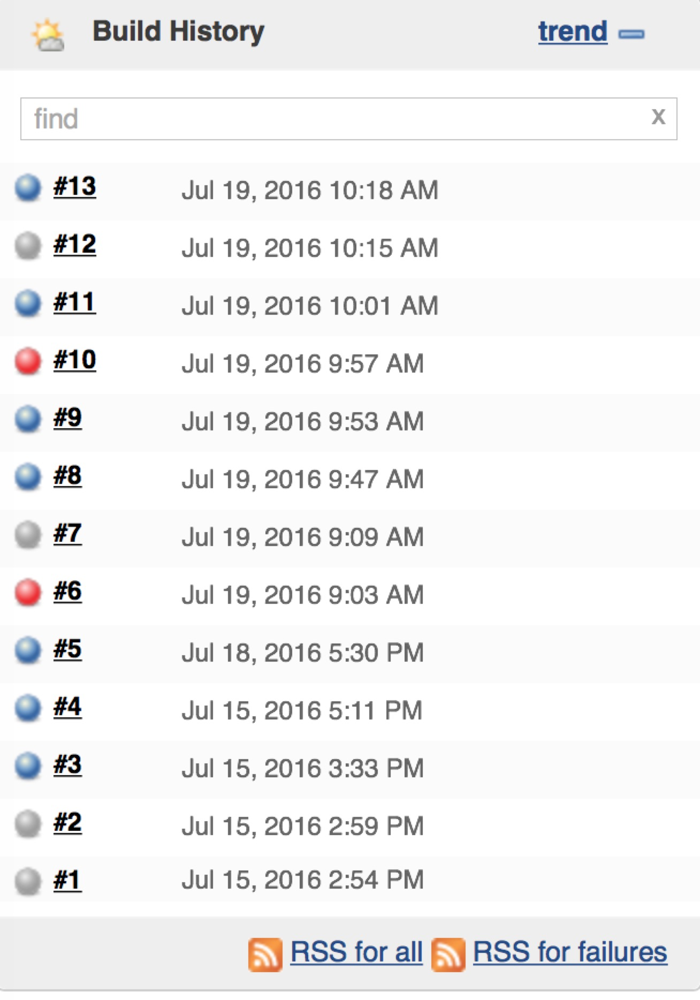

点击可以进入查看单次构建详情。

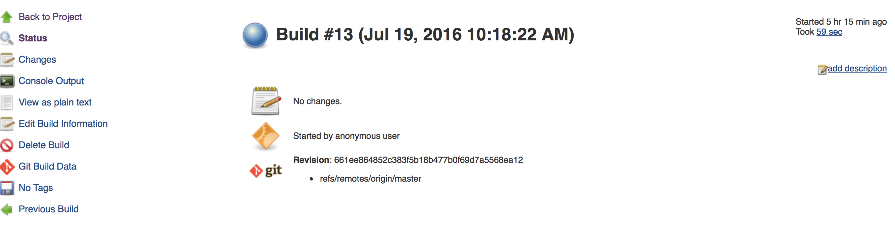

点击 console output 可以查看构建的具体情况。

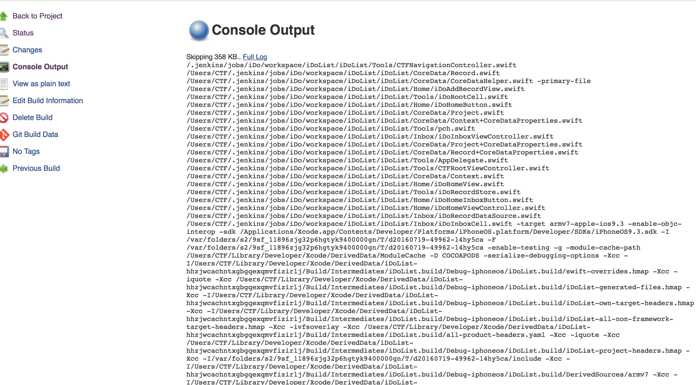

拉到最底部就能看到，我已经构建成功，并上传到fir.im了。
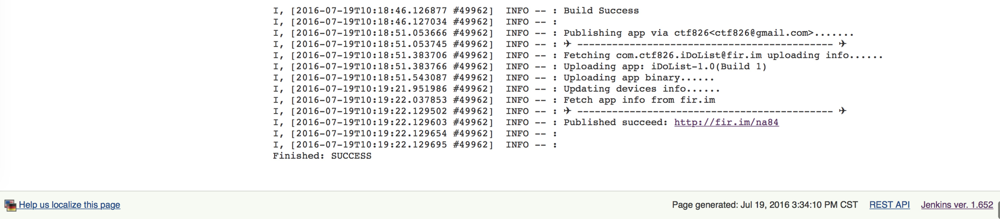

上到fir.im就可以直接扫码下载了

#存在问题
1. 因为项目中我提前配好了证书与描述文件，也默认读者能自行配置好，所以就没有写关于证书与描述文件的东西。fir.im上面应该也有详细的说明，不懂的可以自行上去查看。
2. 在我的想象中，我觉得自动化集成环境，应该是每次有新的提交，就自动打包上传，扫码直接可下载最新版本，并且有自动语法检测，自动测试等功能。**但是** 实际并没有想象中的那么美好，github hooks、自动测试、语法检测还是任重而道远。有空再来研究吧。如果有朋友有清晰明了的教程 还请各位不吝指教！！

