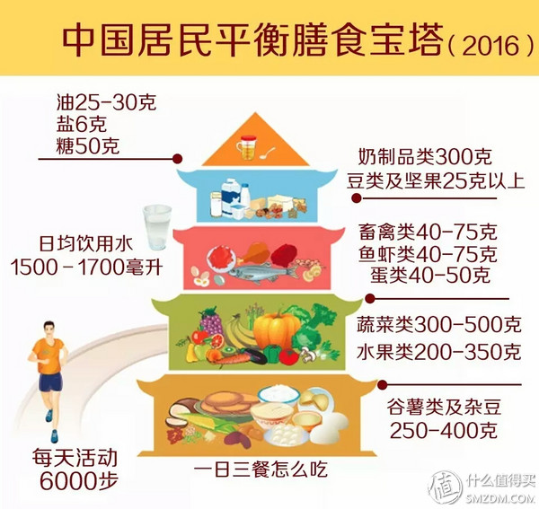

# 装备
* 跑鞋 --- 亚瑟士 gt2000三代

# BMI 体脂率 

* BMI [身体质量指数](http://www.boohee.com/assessment/bmi)   体重/(身高)平方
* 体脂率

# 热量计算
* 1000卡 = 1大卡 = 1千卡 = 1kcal
* 1卡 = 4.2焦耳
* 1千卡 = 4.2千焦

* 1g碳水 = 4大卡
* 1g蛋白质 = 4大卡
* 1g脂肪 = 9大卡

# 基础代谢

* [基础代谢计算](http://www.boohee.com/assessment/bmr)
*  成年男性每天基础代谢在 *1500大卡*左右
*  [计算卡路里](http://www.boohee.com/assessment/calory)

# 每天控制摄入热量，制造200-400大卡的缺口

# 每天饮食多样性  碳水:蛋白质:脂肪 = 6:3:1

# 运动

* 力量训练 ---- 高强度间歇性训练 HIIT
* 有氧运动 ---- 跑步、游泳
* 柔韧训练 ---- 拉伸、瑜伽

* 宗旨 ： 每周加大训练强度，每月减少运动间隔
	有氧 力量交替 练习， 练一天休一天

